# 📘 Cẩm Nang Thực Chiến Vibe Coding & AI Coding Agent (2026 Edition)
### *Đại Học Y Dược TP. Hồ Chí Minh (UMP)*

[](https://dqphong0302.github.io/vibe-coding-guide/)
[](LICENSE)
[](https://dqphong0302.github.io/vibe-coding-guide/#chapter-8)

---

## 🌟 Giới Thiệu Tổng Quan

**Cẩm Nang Thực Chiến Vibe Coding & AI Coding Agent (2026 Edition)** là tài liệu chuyên khảo và nền tảng học tập số toàn diện dành cho cán bộ, giảng viên, sinh viên và nhân viên y tế tại **Đại học Y Dược TP.HCM (UMP)**.

Hệ thống hướng dẫn phương pháp **Vibe Coding** chuẩn mực: *từ ý tưởng nghiệp vụ → đặc tả Spec-Driven → chỉ đạo Tam mã AI Coding Agent (Google Antigravity, OpenAI Codex, Claude Desktop) → kết nối dữ liệu an toàn → kiểm thử UAT → xuất bản ứng dụng thực tế* mà không yêu cầu nền tảng kỹ thuật lập trình chuyên sâu.

---

## 🗺️ Cấu Trúc Toàn Bộ Khóa Học (12 Chương & 2 Chuyên Đề)

```mermaid
graph TD
  A[🏠 Trang Chủ: Vibe Coding Lab] --> B[PHẦN I: NỀN TẢNG & TƯ DUY]
  A --> C[PHẦN II: TAM MÃ AI AGENT]
  A --> D[PHẦN III: QUY TRÌNH TỪ A ĐẾN Z]
  A --> E[PHẦN IV: PHỤ LỤC & STARTER KIT]
  A --> F[PHẦN V: CHUYÊN ĐỀ THỰC HÀNH]

  B --> B1[01 · Bản chất Vibe Coding]
  B --> B2[02 · Kiến trúc Web App]
  B --> B3[03 · Chuẩn bị Workspace]

  C --> C1[04 · Google Antigravity]
  C --> C2[05 · OpenAI Codex]
  C --> C3[06 · Claude Desktop & MCP]
  C --> C4[07 · So sánh & Phối hợp]

  D --> D1[08 · Thiết kế UI/UX & Google Stitch]
  D --> D2[09 · Dữ liệu & Bảo mật]
  D --> D3[10 · Đặc tả Spec-Driven]
  D --> D4[11 · Kiểm thử & Sửa lỗi]
  D --> D5[12 · Go-Live & Xuất bản]

  E --> E1[Phụ lục A: Thư viện Prompt A-Z]
  E --> E2[Phụ lục C: Bộ Starter Kit Tải về]

  F --> F1[⚕ Vibe Coding Y khoa - 4 Buổi]
  F --> F2[🏛 Số hóa Quy trình 8 Cổng Kiểm soát]
```



---

## 🎯 Điểm Nhấn & Chuyên Đề Nổi Bật

### 1. ⚕ Chuyên Đề 1: Lộ Trình Vibe Coding Y Khoa (4 Buổi)
* **Buổi 1:** Khởi động & Tư duy Vibe Coding y tế (Prompt CRAFT, công cụ Google AI Studio / Stitch).
* **Buổi 2:** Thiết kế giao diện lâm sàng chuẩn hóa (Quiz giải phẫu, Bệnh nhân ảo, Lịch trực khoa phòng).
* **Buổi 3:** Kết nối 5 mô hình dữ liệu thực chiến & Tích hợp 4 tính năng AI trợ lý (Tóm tắt, Kiểm tra thành phần, Phân loại công văn, Dự thảo phản hồi).
* **Buổi 4:** Đóng gói, kiểm thử an toàn PII & Thuyết trình Demo Day.
* *Trọn bộ 12 hình ảnh minh họa thực tế xuyên suốt.*

### 2. 🏛 Chuyên Đề 2: Số Hóa Quy Trình 8 Cổng Kiểm Soát
* Chuyển đổi thủ tục giấy tờ hành chính sang quy trình số minh bạch, có thể kiểm toán (*Audit Trail*).
* **8 Cổng kiểm soát:** Chọn quy trình → Vẽ AS-IS → Thiết kế TO-BE & SLA → Khóa dữ liệu 4 cấp độ → Đặc tả Spec 10 phần → Prototype theo lát cắt → UAT quyền âm → Thí điểm có rollback.
* Căn cứ pháp lý: **Luật Bảo vệ Dữ liệu Cá nhân 2025** & **Nghị định 310/2026/NĐ-CP**.

### 3. 🗄️ 5 Mô Hình Kết Nối Dữ Liệu Trong Vibe Coding:
1. **00 · LocalStorage:** Offline 100%, không cần server, an toàn trên trình duyệt cá nhân.
2. **01 · Google Sheets + Apps Script:** Biểu mẫu gửi dữ liệu vào bảng tính chia sẻ nội bộ.
3. **02 · Node SQLite (`node:sqlite`):** REST API lưu trữ file CSDL `.db` nhẹ nhàng trong mạng LAN.
4. **03 · Cloud Database Supabase:** Đăng nhập Anonymous & chính sách Row Level Security (RLS) khóa quyền dữ liệu.
5. **04 · AI Backend Proxy:** Browser gọi backend giữ API Key an toàn, chế độ `MOCK_AI=true` thử nghiệm.

---

## 🎨 Hệ Thống Thiết Kế (UMP Academic Vibe)

* **Phông chữ:** [Manrope](https://fonts.google.com/specimen/Manrope) (Tiêu đề), [Inter](https://fonts.google.com/specimen/Inter) (Văn bản), [DM Mono](https://fonts.google.com/specimen/DM+Mono) (Khối mã nguồn).
* **Bảng màu:**
  * 🟦 **UMP Primary Blue:** `#00346f`
  * 🔹 **Secondary Blue:** `#0062a2` / `#62b0fe`
  * 🟨 **Accent Gold:** `#ffcc00`
  * ⚪ **Surface Ivory:** `#fbf8ff` / `#ffffff`
  * ⬛ **On-Surface Ink:** `#04154e`
* **Hiệu ứng:** Glassmorphism Blur 12px, bo góc mượt mà (12px–18px), thẻ unboxed hiển thị rộng rãi, thanh đọc dính (*Sticky Reader Topbar*) với chỉ số trang thời gian thực.

---

## 🚀 Hướng Dẫn Cài Đặt & Chạy Cục Bộ

### Yêu cầu:
* Python 3.9+ hoặc Node.js 18+

### 1. Khởi động Web Server:
```bash
# Di chuyển vào thư mục site
cd site

# Chạy web server với Python
python3 -m http.server 8000
```
Truy cập trình duyệt tại: **`http://localhost:8000`**

### 2. Tự Động Đóng Gói (Build Bundle):
```bash
# Đóng gói 17 module HTML vào page-content.js (dành cho chế độ xem offline)
node scripts/build_page_bundle.mjs
```

---

## 📁 Cấu Trúc Thư Mục

```text
site/
├── index.html                   # Shell ứng dụng chính (Navigation, Reader Topbar)
├── slide.html                   # Bộ slide trình chiếu trực quan 51 trang
├── admin-guide.html             # Bản độc lập hướng dẫn số hóa 8 cổng
├── partials/
│   └── pages/                   # 17 tệp HTML độc lập dễ dàng chỉnh sửa trực tiếp
│       ├── home.html            # Trang chủ phong cách Stitch UMP
│       ├── chapter-1.html ... 12.html # 12 chương chuyên khảo
│       ├── appendix-a.html      # Phụ lục A (Thư viện Prompt A-Z)
│       ├── appendix-c.html      # Phụ lục C (Starter Kit)
│       ├── medical-course.html  # Chuyên đề Vibe Coding Y khoa
│       └── admin-guide.html     # Chuyên đề Số hóa quy trình 8 cổng
├── css/
│   ├── stitch-ump-theme.css     # Design System chuẩn UMP Academic Vibe
│   ├── components.css           # Thẻ, bảng, hộp code, nút bấm
│   ├── medical-course.css       # Layout chuyên đề y khoa & figure
│   └── admin-guide.css          # Layout lộ trình 8 cổng kiểm soát
├── js/
│   ├── app.js                   # Logic điều hướng, tiến độ học, sao chép prompt
│   ├── content-loader.js        # Trình tải động HTML module
│   └── page-content.js          # Bundle 17 module cho chế độ offline
├── assets/                      # Trọn bộ hình ảnh minh họa y khoa & UI
└── starter/                     # Bộ template mẫu tải về (SPEC, Checklists, JSON)
```

---

## 👨‍🏫 Tác Giả & Bản Quyền

* **Giảng viên / Tác giả:** ThS. Đặng Quốc Phong — Khoa Khoa học Cơ bản, Đại học Y Dược TP.HCM.
* **Đồng hướng dẫn thực hành:** ThS. Lâm Hồng Thịnh — Phòng Khoa học Công nghệ, Đại học Y Dược TP.HCM.
* **Đơn vị phát hành:** Đại học Y Dược TP. Hồ Chí Minh (UMP) — *2026 Edition*.
* **Giấy phép:** [MIT License](LICENSE).
